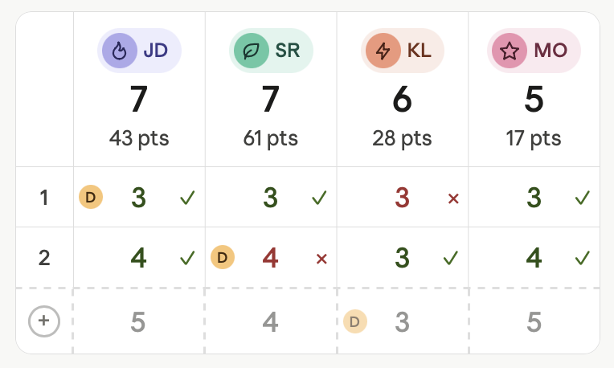

# Scorecard (game route)
We want to add the scorecard component to the game page. Here are the requirements.

## High level requirements
* The scorecard should go in the main content section.

## UX design
 is roughly what we want to build

* In the header row we have three rows: 1.) the player avatar with both icon and initials, 2.) The phase the player is on, 3.) the tiebreaker score
* Each completed round has a row. 
    * By default, each row is like this: For each player we have a cell that contains 3 things. 1.) on the left, either nothing or the dealer chip if that player is the dealer for that round. 2.) In hte middle is the phase number the player was on for that round. It has green text if they completed the phase and red text if they didn't. The player who won the round (by going out) gets a circle around their phase number. 3.) On the right is a check or x icon matching if they completed the phase and the same color scheme.
    * Consider both light and dark mode when choosing the color of the fonts.
    * We can also expland a single row (only one row in the whole table can be expanded at a time) to show more details. When expanded, let's keep the same UX but grow the row (animated) and fade in the tiebreaker score as well as total tiebreaker score after that round. So maybe 3 rows in a cell. Top row is what's already there when not "focused". Middle row is the tiebreaker value from that round. Bottom row is tiebreaker summed up so far to taht point in the game.
    * By default no rows are focused. On clicking an unfocused row, that row gets focused and any other ones get unfocused. On clicking a focused row, that row gets unfocused and no rows are focused. Clicking outside the table unfocuses all.
* The bottom row of the table is a row for the active phase. In place of the round number is a plus icon. The table has dashed lines around this area like the screenshot. The text is a gray to show it's in progress. This row matches the rules of the other rows in terms of player cells except there is no icon since it's in progress. Clicking anywhere in this row brings up the dialog from the bottom for adding in new scores.
* The dialog for adding new scores will be implemented in the future. For now, just have a super basic form that has all of the fields needed to add a new round in. Don't style it, just a plain form for now.

## FUnctionality requirements
* The scorecard can scroll but the header row does not
* We will need some way to keep track of the running total of "tiebreaker points". This can be in the db or calculated on the fly. Consider perf and memory usage

## Spec from agent who created the POC.
Please let the notes I gave above take precedence but here is a description form the agent who created the POC. Note this was simplified and doesn't have context of the repo like you do.

# Scoreboard Table — Design Spec

## Overview

A mobile-first scoreboard table for a card game. Players are columns, rounds are rows. The table scrolls horizontally when there are 5+ players and vertically as rounds accumulate. The design is intentionally light — the header carries most of the identity and scoring detail; the body rows stay minimal and scannable.

---

## Layout Structure

The table is a fixed-layout grid with:
- **Column 0** — a narrow fixed column (36px wide) for round numbers
- **Columns 1–N** — equal-width flex columns, one per player

The table has a border, rounded corners, and a subtle border between every cell. All internal cell borders are 0.5px.

---

## Header Row

Each player column in the header contains three stacked elements, all center-aligned:

### 1. Identity Pill
A horizontal pill containing the player's icon and initials side by side.

- **Shape:** Rounded pill (border-radius: 999px)
- **Background:** A light tint from the player's color ramp (e.g. soft lavender, soft green)
- **Contents (left to right):**
  - A small filled circle (22×22px, fully round) containing the player's chosen icon. The circle uses a mid-ramp fill from the player's color so it visually separates from the pill background.
  - The player's initials as text (12px, weight 500) in a dark shade of the player's color ramp
- **Padding:** 3px on all sides, 8px on the right, 3px on the left (icon sits flush inside)

Each player has a unique color identity. Examples:
| Player | Pill bg | Icon circle bg | Text color |
|--------|---------|----------------|------------|
| JD | `#EEEDFE` | `#AFA9EC` | `#3C3489` |
| SR | `#E1F5EE` | `#5DCAA5` | `#085041` |
| KL | `#FAECE7` | `#F0997B` | `#712B13` |
| MO | `#FBEAF0` | `#ED93B1` | `#72243E` |

### 2. Phase Number
The player's current phase — the primary scoring value.

- **Font size:** 22px
- **Font weight:** 500
- **Color:** Primary text color
- **Line height:** 1

### 3. Points
The player's point total — used only as a tiebreaker.

- **Font size:** 13px
- **Font weight:** 400
- **Color:** Secondary text color
- **Format:** `{n} pts` (e.g. `43 pts`)

### Column 0 (top-left cell)
Empty. No label.

---

## Body Rows — Completed Rounds

Each completed round is a row. The leftmost cell shows the round number; each player cell shows the phase they were on that round and whether they passed or failed.

### Round Number Cell (Column 0)
- **Font size:** 13px
- **Font weight:** 500
- **Color:** Secondary text color
- **Alignment:** Center

### Player Result Cell
Each cell has three elements positioned independently:

#### Dealer Chip (conditional)
Shown only in the cell of the player who dealt that round.

- **Shape:** Circle, 15×15px
- **Background:** Amber — `#FAC775`
- **Text:** `D`, 9px, weight 500, color `#412402`
- **Position:** Absolutely positioned, left edge of the cell (3px from left), vertically centered
- The dealer chip does **not** affect the centering of the phase number

#### Phase Number (center)
The phase the player was attempting that round.

- **Font size:** 17px
- **Font weight:** 500
- **Color:**
  - Passed: `#27500A` (dark green)
  - Failed: `#A32D2D` (dark red)
- **Position:** Centered in the cell (the dealer chip and result icon are both absolutely positioned so this element stays truly centered regardless)

#### Result Icon (right)
A ✓ or ✕ indicating pass or fail. This is the secondary accessibility signal — color alone is never the only differentiator.

- **Font size:** 13px
- **Color:**
  - ✓ pass: `#3B6D11`
  - ✕ fail: `#A32D2D`
- **Position:** Absolutely positioned, right edge of the cell (5px from right), vertically centered

### Accessibility
Pass and fail are distinguished by **both color and symbol shape** (✓ vs ✕). Neither signal is used alone. This ensures the table is readable for users with color vision differences.

---

## Ghost Row — Pending Round

The bottom row of the table represents the next round, pre-populated with known information before scores are entered. It is visually distinct from completed rows to indicate it is not yet finalized.

### Visual Treatment
- **Top border:** 1.5px dashed, using the tertiary border color (vs 0.5px solid for completed rows)
- **All internal borders:** 1.5px dashed
- **Opacity of content:** ~55% — visible enough to read, clearly lighter than committed data
- The row uses the same height and padding as completed rows

### Round Number Cell (Column 0)
Contains a circled `+` icon instead of a round number.

- **Circle:** 20×20px, fully round
- **Border:** 1.5px solid, secondary border color
- **Contents:** `+` character, ~14px, tertiary text color
- The `+` communicates this row is an action target. Once tapped and the round is submitted, this cell transitions to the round number.

### Player Result Cells
Pre-populated with the phase number each player will be attempting (based on their current phase from the header). No ✓ or ✕ is shown — the absence of a result icon is itself the signal that this round is pending.

- **Phase number:** Same size and weight as completed rows (17px, weight 500), rendered at ~55% opacity in the secondary text color (no green/red — neutral)

### Dealer Chip (Ghost)
The dealer chip appears in the cell of the player who is next to deal, following the rotation from previous rounds.

- Same size and styling as the completed-row dealer chip
- Rendered at ~60% opacity to match the ghost row treatment

### Tap Behavior
Tapping anywhere on the ghost row opens the score entry flow for that round.

---

## Horizontal Scrolling (5+ Players)

When there are more than 4 players, the table scrolls horizontally. Column 0 (round numbers) is **sticky** — it remains fixed while player columns scroll beneath it. The header row also scrolls with the table (it is not sticky vertically).

---

## Typography Summary

| Element | Size | Weight | Color |
|---|---|---|---|
| Player initials | 12px | 500 | Player dark ramp |
| Header phase | 22px | 500 | Primary |
| Header points | 13px | 400 | Secondary |
| Round number | 13px | 500 | Secondary |
| Body phase number | 17px | 500 | Green / Red (or neutral for ghost) |
| Result icon (✓ ✕) | 13px | 400 | Green / Red |
| Dealer chip label | 9px | 500 | `#412402` |

---

## Spacing & Sizing

| Element | Value |
|---|---|
| Round number column width | 36px |
| Player columns | Equal flex, minimum ~70px |
| Header cell padding | 10px vertical, 3px horizontal |
| Body cell padding | 10px vertical, 2px horizontal |
| Cell border width (solid) | 0.5px |
| Cell border width (dashed) | 1.5px |
| Table border radius | Large (e.g. 12px) |
| Dealer chip size | 15×15px |
| Identity pill icon circle | 22×22px |

---

## Color Reference

| Token | Usage |
|---|---|
| Primary text | Header phase number |
| Secondary text | Points, round numbers, ghost phase numbers |
| Tertiary text | Ghost + icon |
| Primary border | Outer table border |
| Secondary border | Circled + border in ghost row |
| Tertiary border | Internal cell borders, dashed ghost borders |
| `#27500A` | Pass phase number |
| `#3B6D11` | Pass ✓ icon |
| `#A32D2D` | Fail phase number and ✕ icon |
| `#FAC775` | Dealer chip background |
| `#412402` | Dealer chip text |

---

## Notes / Clarifications (gathered during requirement gathering)

These are decisions made while turning the spec above into an implementation plan. Each item lists the question, the chosen answer, and why it matters.

### 1. Dealer source — no schema change
**Question:** The `Round` data model has no dealer field, but the spec requires a dealer chip on each row including the ghost row.
**Decision:** Derive the dealer purely from `activePlayers` rotation: round N's dealer is `activePlayers[(N − 1) % activePlayers.length]`. The ghost row uses the same formula for the next round.
**Implication:** No DB schema change for dealer. The score-entry form does **not** ask for a dealer. If `activePlayers` changes mid-game (player added/removed), the rotation re-anchors from the new list — acceptable for v1.

### 2. Round winner — required field on `Round`
**Question:** The spec requires circling the phase number of the player who "went out" (won the round). Today there is no way to know who that was.
**Decision:** Add a **required** `roundWinnerId: PlayerId` field to `Round`. The score-entry form must always select a winner; no round can be saved without one.
**Implication:** This is a schema change. Existing rounds in IndexedDB (if any) must be migrated. Since the prior game flow was gutted (commit `4186ffa`), we assume no production rounds exist and will treat this as a fresh-schema field rather than writing a backfill heuristic.

### 3. Header / expanded "tiebreaker" value — driven by game setting
**Question:** The mock shows `43 pts`, but the game has 6 different `tiebreaker` settings (lowestPoints, highestPoints, fewestSkips, mostSkipped, fewestWilds, roundsWon).
**Decision:** The header value, the per-round value (middle row when expanded), and the running total (bottom row when expanded) all reflect the game's configured `tiebreaker`. Examples: `lowestPoints` / `highestPoints` → `43 pts`; `fewestSkips` / `mostSkipped` → `2 skips`; `roundsWon` → `1 won`.

### 4. `skipped` and `satOut` cell rendering
**Question:** The spec covers only completed (green ✓) and failed (red ✕), but `PhaseStatus` also has `skipped` and `satOut`.
**Decision:**
- `skipped` → yellow phase number + ⤴ icon
- `satOut` → gray phase number + — (em dash) icon

### 5. Player identity in header — reuse existing `PlayerAvatar`
**Question:** The POC spec describes a 3-tint color ramp per player (pill bg / icon-circle bg / text), but players have only a single `color` hex.
**Decision:** Use the existing `PlayerAvatar` component with the `icon-initials` variant rather than recreating the POC's tinted-ramp pill. The scorecard does not need to exactly match the POC mock for header pills.

### 6. Tiebreaker data availability
For the header / expanded row to display the configured tiebreaker (decision #3), each tiebreaker needs a data source per `RoundScore`. Status today:

| Tiebreaker | Source | DB change needed? |
|---|---|---|
| `lowestPoints` / `highestPoints` | `RoundScore.score` | No |
| `fewestSkips` / `mostSkipped` | Count `phaseStatus === "skipped"` per player | No (derivable) |
| `roundsWon` | Count rounds where `roundWinnerId === playerId` (uses field added in #2) | No (derivable, once #2 lands) |
| `fewestWilds` | **Not tracked** — would need `wildsUsed: number` on `RoundScore` | **Yes** |

**Decision for `fewestWilds`:** Keep wilds-tracking out of this PR's scope. When `game.settings.tiebreaker === "fewestWilds"`, the scorecard falls back to displaying points (`{n} pts`) and the running total of points. Adding a required `wildsUsed: number` field to `RoundScore` (and a wilds input to the score-entry form) is left as a follow-up so this PR stays focused on the scorecard UI and the already-needed `roundWinnerId` schema change.

